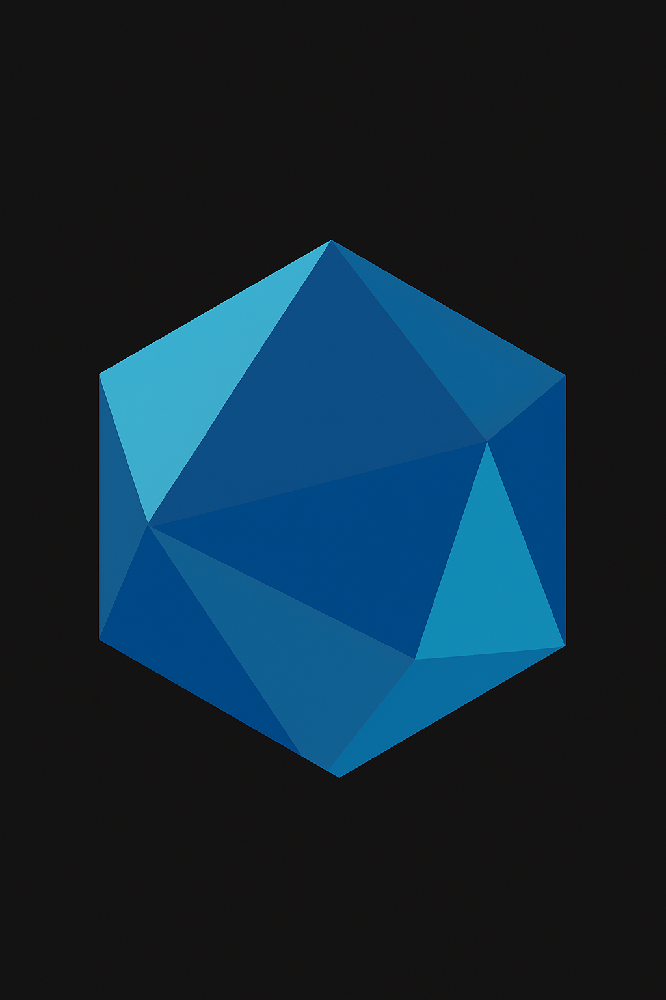

# 🤖 Profile Chat - ChatBot AI Pessoal

<div align="center">
    
    
[](https://lukasdevjobs1.github.io/profile-chat/)
[](https://profile-chat-lukasdevjobs1.vercel.app/)
[](https://developer.mozilla.org/en-US/docs/Web/JavaScript)
[](https://groq.com/)

</div>

## 📋 Sobre o Projeto

**Profile Chat** é um chatbot AI inteligente desenvolvido para apresentar meu portfólio profissional de forma interativa. O bot conhece todos os meus 13 repositórios, tecnologias, projetos e pode responder perguntas sobre minha experiência como desenvolvedor.

### 🎯 Objetivo

Criar uma experiência única para recrutadores, colegas desenvolvedores e curiosos que querem conhecer meu trabalho de forma conversacional e inteligente.

## ✨ Funcionalidades

- 🤖 **ChatBot AI Inteligente** - Powered by Groq API (Llama 3.1)
- 📊 **Catálogo Completo** - Conhece todos os 13 repositórios do GitHub
- 🎨 **Interface Moderna** - Design responsivo e animações suaves
- 🔒 **Seguro** - API keys protegidas via variáveis de ambiente
- 📱 **Responsivo** - Funciona perfeitamente em mobile e desktop
- 🚀 **Deploy Automático** - GitHub Pages + Vercel
- 🎭 **Personalidade** - Respostas contextualizadas e profissionais

## 🛠️ Tecnologias Utilizadas

### Frontend

- **HTML5** - Estrutura semântica moderna
- **CSS3** - Animações, gradientes e responsividade
- **JavaScript ES6+** - Lógica do chatbot e integração com API
- **Fetch API** - Comunicação com serviços externos

### Backend/API

- **Vercel Functions** - Serverless API proxy
- **Groq API** - Modelo de linguagem Llama 3.1-8b-instant
- **GitHub API** - Integração com repositórios (futuro)

### Arquitetura

- **SDK Modular** - Arquitetura MVC organizada
- **Services Layer** - Separação de responsabilidades
- **Configuration Management** - Configurações centralizadas

## 📁 Estrutura do Projeto

```
profile-chat/
├── 📂 api/
│   └── chat.js                 # Proxy serverless para Groq API
├── 📂 botData/
│   ├── api-config.json         # Configurações da API (template)
│   ├── chatbot-config.json     # Configurações do chatbot
│   ├── projectsCatalog.json    # Catálogo completo de projetos
│   ├── systemPrompt.txt        # Prompt do sistema AI
│   └── avatar.webp            # Avatar do chatbot
├── 📂 sdk/
│   ├── 📂 src/
│   │   ├── 📂 controllers/     # Controladores MVC
│   │   ├── 📂 services/        # Serviços (API, GitHub, etc)
│   │   ├── 📂 views/          # Componentes de interface
│   │   └── index.js           # Entry point do SDK
│   ├── ew-chatbot.css         # Estilos do SDK
│   └── ew-chatbot.html        # Template do chatbot
├── index.html                 # Página principal
├── script.js                  # Lógica principal
├── styles.css                 # Estilos globais
└── vercel.json               # Configuração de deploy
```

## 🚀 Como Usar

### Acesso Direto

- **GitHub Pages**: [lukasdevjobs1.github.io/profile-chat](https://lukasdevjobs1.github.io/profile-chat/)
- **Vercel**: [profile-chat-lukasdevjobs1.vercel.app](https://profile-chat-lukasdevjobs1.vercel.app/)

## 💬 Exemplos de Conversas

### Perguntas sobre Projetos

- _"Quais são seus principais projetos?"_
- _"Me fale sobre o Git_Projects"_
- _"Você tem experiência com Python?"_

### Perguntas Técnicas

- _"Quais tecnologias você domina?"_
- _"Você trabalha com AWS?"_
- _"Tem experiência com chatbots?"_

### Perguntas Profissionais

- _"Qual sua formação?"_
- _"Como posso entrar em contato?"_
- _"Você está disponível para projetos?"_

## 📊 Portfólio Integrado

O chatbot conhece detalhadamente:

### 🏆 Projetos Originais (5)

- **Git_Projects** - Portfólio técnico principal
- **profile-chat** - Este chatbot AI
- **Exercicios_praticos_InfinitySchool** - Exercícios Python
- **bia** - Projeto JavaScript
- **lukasdevjobs1** - Site pessoal

### 🔄 Projetos Forked (8)

- **semana-javascript-expert09** - Chatbot offline
- **grokking_algorithms** - Algoritmos e estruturas
- **developer-roadmap** - Roadmaps de carreira
- **mcp** - AWS MCP Servers
- **BibliotecaDev** - Biblioteca de livros
- **Desafios_Infinity_School** - Desafios Python
- **Agents-Prompts** - Prompts para IA

### 🛠️ Stack Tecnológico

- **Frontend**: HTML5, CSS3, JavaScript
- **Backend**: Python, Node.js
- **AI/Chatbots**: Groq API, Prompt Engineering
- **Cloud**: AWS, GitHub Pages, Vercel
- **Tools**: Git, GitHub, Cursor IDE

## 🤝 Contribuições

Contribuições são bem-vindas! Este projeto serve como template para outros desenvolvedores criarem seus próprios chatbots de portfólio.

### Como Contribuir

1. Fork o projeto
2. Crie uma branch para sua feature
3. Commit suas mudanças
4. Push para a branch
5. Abra um Pull Request

## 📄 Licença

Este projeto está sob a licença MIT. Veja o arquivo [LICENSE](LICENSE) para mais detalhes.

## 📞 Contato

**Lukas Albertino Gomes**

- 📧 Email: [luk.devjobs@gmail.com](mailto:luk.devjobs@gmail.com)
- 💼 LinkedIn: [lukas-gomes-4470a2269](https://www.linkedin.com/in/lukas-gomes-4470a2269/)
- 🐙 GitHub: [@lukasdevjobs1](https://github.com/lukasdevjobs1)
- 🐦 Twitter: [@LukDev13](https://x.com/LukDev13)
- 💬 WhatsApp: [+55 85 99257-0216](https://wa.me/5585992570216)

---

<div align="center">

**🚀 Desenvolvido com paixão por tecnologia e IA**

[](https://github.com/lukasdevjobs1/profile-chat/stargazers)
[](https://github.com/lukasdevjobs1/profile-chat/network/members)

</div>
